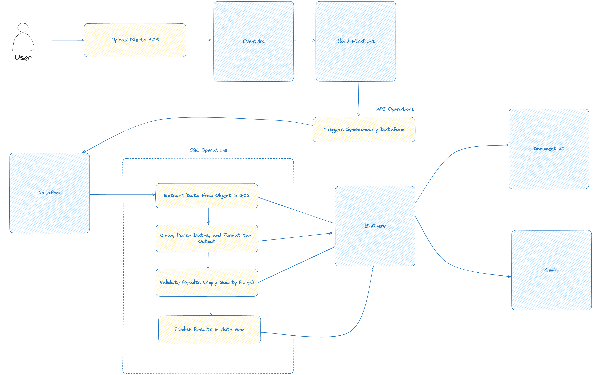

# docai-bigquery-demo
This is a sample pipeline to demonstrate how DocAI can be integrated with BigQuery using Cloud Workflows.

## High Level Architecture

The general architecture of the solution is depicted in the diagram below:

## Building Blocks

The solution consists of the following building blocks:

* **Google Cloud Storage (GCS):** Used to store the input documents and the output data extracted by DocAI.
* **Document AI:** Used to extract data from the input documents.
* **Cloud Workflows:** Used to orchestrate the data processing pipeline.
* **Dataform:** Used to clean, transform, and load the data into BigQuery.
* **BigQuery:** Used to store the final processed data.

## Deployment

1. **Set up the infrastructure:**
    * Use the Terraform files in the `terraform/docai-bigquery-tf` directory to create the required infrastructure, including a GCS bucket, a BigQuery dataset, and a Cloud Workflows trigger.
    * Update the variables in the `terraform/docai-bigquery-tf/variables.tf` file to match your environment.
    * Run `terraform init`, `terraform plan`, and `terraform apply` to deploy the infrastructure.
2. **Configure the Dataform project:**
    * Update the `dataform/workflow_settings.yaml` file with your project ID, location, and dataset names.
    * Update the SQLX files in the `dataform/definitions` directory to match your DocAI processor and LLM model names.
3. **Deploy the Cloud Workflow:**
    * Deploy the `workflows/main.yaml` file to Cloud Workflows.
    * Configure the workflow trigger to be activated by new files arriving in the GCS bucket (using eventArc type of triggers)

## Usage

1. Upload a document to the GCS bucket.
2. The Cloud Workflow will be triggered and will:
    * Call Dataform to create a compilation result.
    * Create a Dataform workflow invocation.
    * Monitor the Dataform workflow invocation until it completes.
3. Dataform will:
    * Extract data from the document using DocAI.
    * Clean, transform, and validate the extracted data.
    * Load the processed data into BigQuery.
4. You can then query the processed data in BigQuery.